# HACKUPC26 P2P Game Platform

Multiplayer P2P gaming platform with 7 games. Play Battleships, Karting, Piano, Head Soccer, Minecraft, Mascota, and Penalties with friends via decentralized networking.

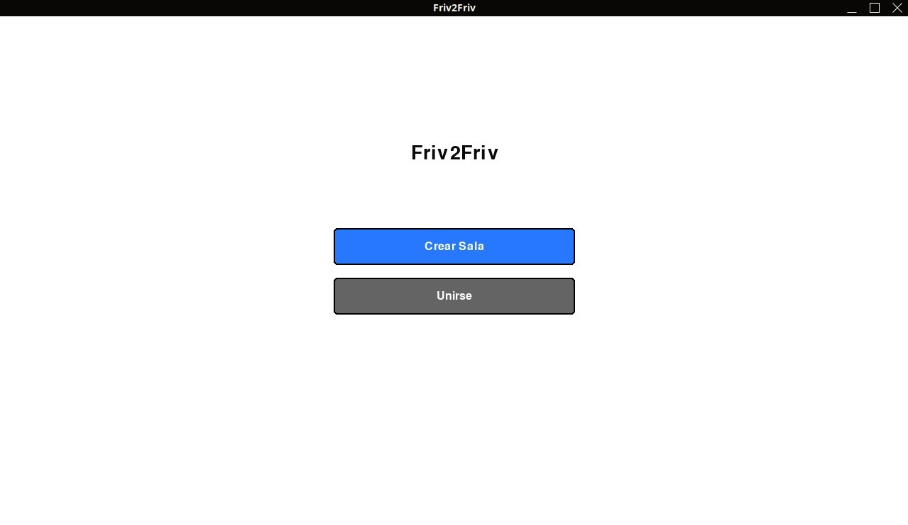

## Games

| Game | Description |
|------|------------|
| **Battleships** | Classic naval combat - place fleet, sink enemy ships |
| **Karting** | Top-down racing on multiple tracks |
| **Piano** | Real-time collaborative MIDI piano |
| **Head Soccer** | 2D football, first to 5 goals wins |
| **Minecraft** | 2D block world with inventory & crafting |
| **Mascota** | Virtual pet with inventory system |
| **Penalties** | Penalty shootout with direction & power |

## Installation

```bash
pip install -r requirements.txt
```

### Dependencies
- Python 3.8+
- pygame >= 2.5.0
- PyOpenGL >= 3.1.7
- rsa >= 4.9
- pycryptodome (for AES encryption)

## Quick Start

```bash
python main.py
```

### Create Room
1. Click **Crear Sala**
2. Enter player name + room code
3. Click **Crear**
4. Share the generated room hash

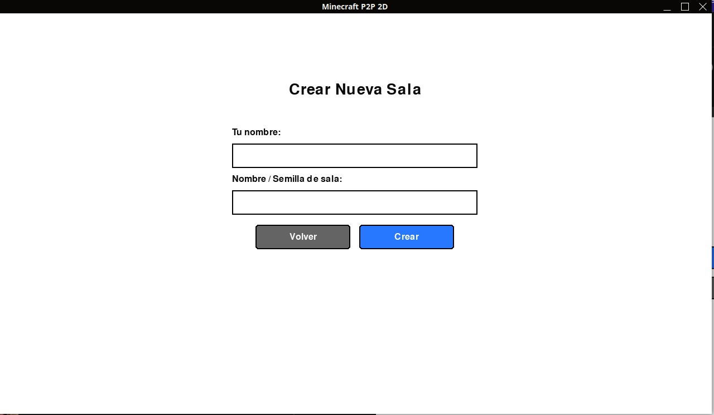

### Join Room
1. Click **Unirse**
2. Enter your name + room hash
3. Click **Unirse**

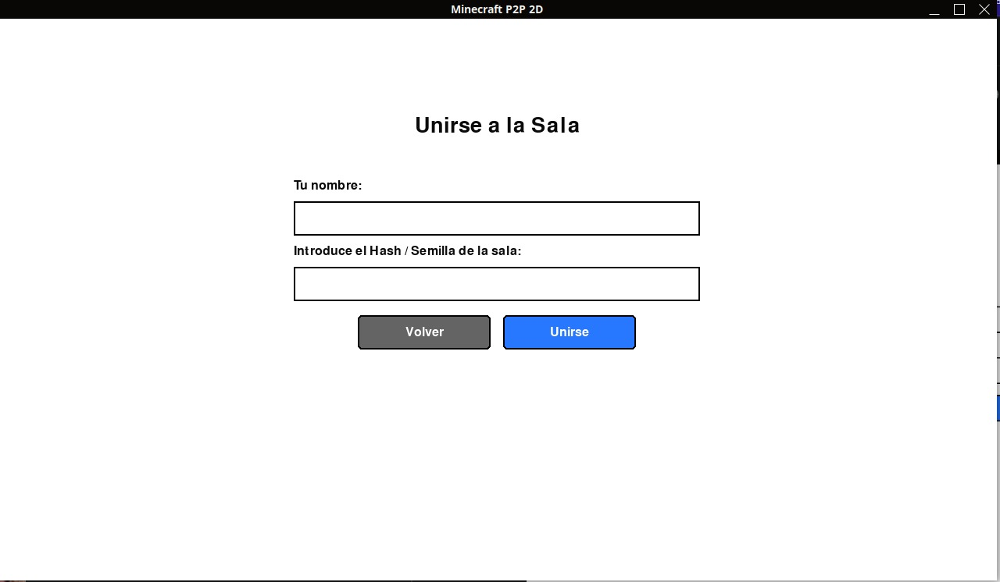

## Lobby

In the lobby:
- Select a game from the grid
- Chat with players
- Host clicks **Iniciar partida** to start

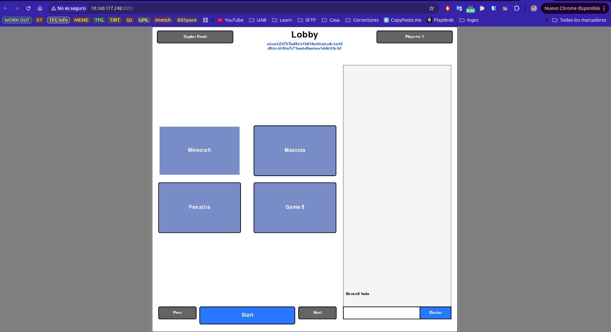

## Controls

| Game | Controls |
|------|---------|
| **Battleships** | Click to place, SPACE/ENTER to fire |
| **Karting** | Arrow keys |
| **Piano** | Keyboard (A,W,S,E...) or click |
| **Head Soccer** | A/D move, W jump, M kick, SPACE header |
| **Minecraft** | Arrow keys move, click place/break blocks |
| **Mascota** | Click buttons to feed/play |
| **Penalties** | Click direction + power bar |

## Architecture

```
NetworkManager (network.py)
├── UDP Discovery (port 14201)  → Find peers locally
├── TCP Connections (port 14200+) → Reliable P2P events
├── RSA Keys (keys/)              → Peer authentication
└── Ledger Sync                 → Replicated event log
```

## Screenshots

### Battleships
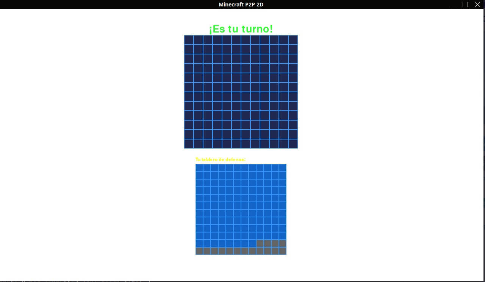

### Karting

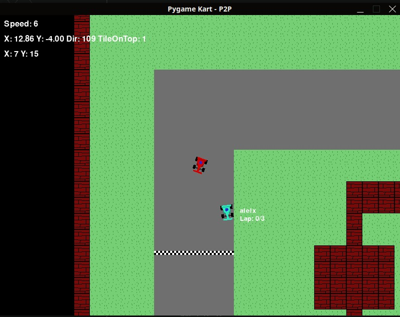

### Minecraft

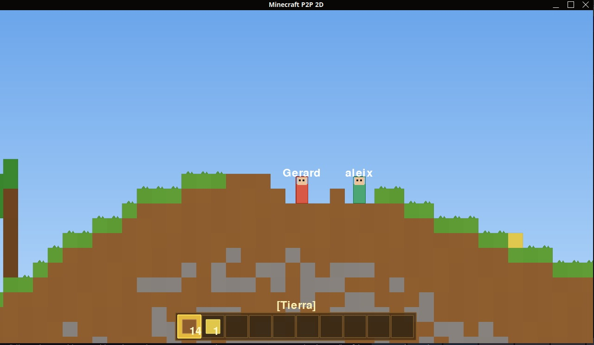

### Head Soccer

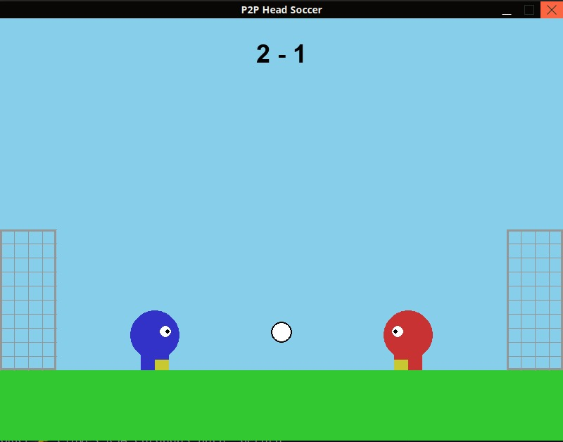

### Penalties

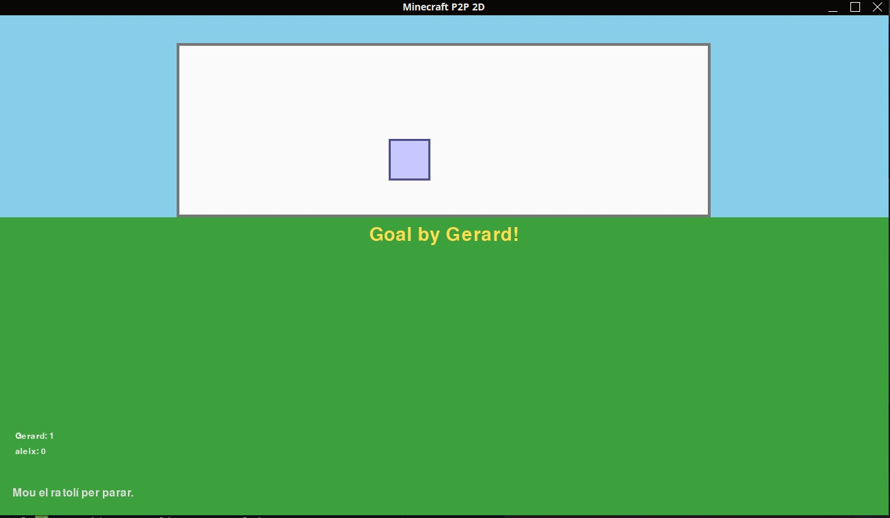

### Mascota

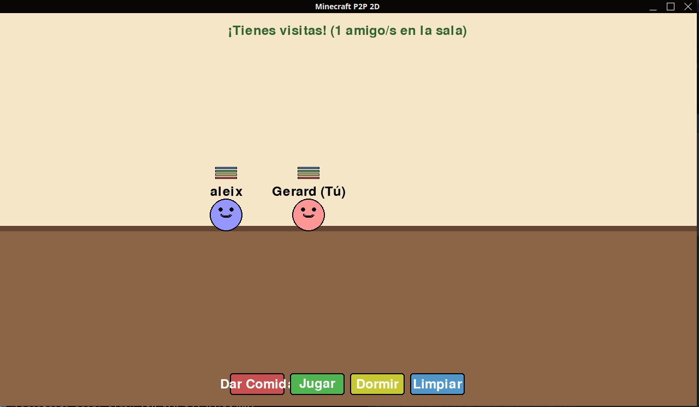

### Piano

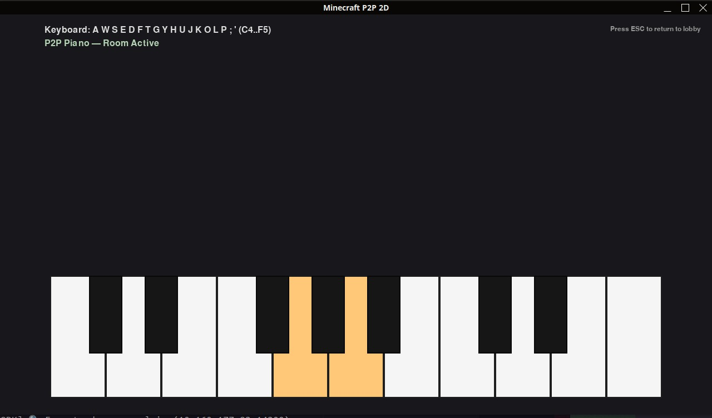
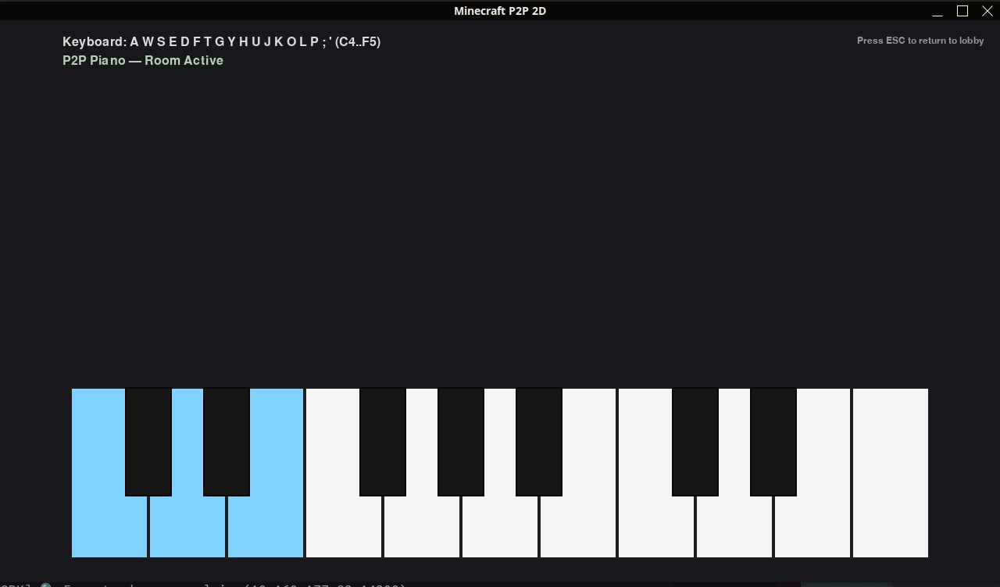

## Demo Videos

[](https://www.youtube.com/watch?v=ucMd_BHOZ1w)


## License

MIT

---

Built for HACKUPC 2026